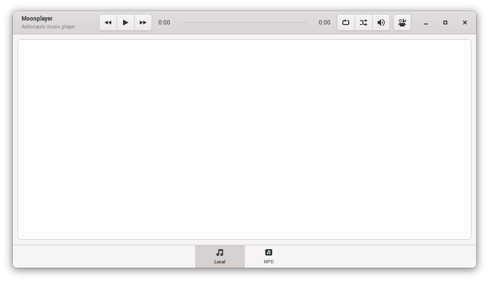

[![License][LicenseBadge]][licenseURL]

# What is this?

A GTK music player written in pure Lua.



<p align="center">
  <i>
    <sup>Reference screenshot</sup>
  </i>
</p>

# Running

__NOTE 1__: MoonPlayer is still not finished and currently can't play music, but still, you can run `Main.lua` for a preview of the app.

__NOTE 2__: In [this commit](https://github.com/M1que4s/Moonplayer/commit/87ca3044f44c614b533633e98017da428df78c0a) I added support for auto-scan the user music folder, but if the folder has a lot of music files, the app can crash. I'm currently working on this problem

You will need:

 * Lua 5.1+ (LuaJIT also works)
 * [lgi](https://github.com/pavouk/lgi/)

You can install lgi using LuaRocks:

```
luarocks install lgi
```

Or with the package manager of your distro (if available).

Before running Moonplayer, you'll need compile the `Data/Resources.xml` file:

```
glib-compile-resources Data/Resources.xml
```

And finally you can run the app:

```
lua Main.lua
```

[LicenseBadge]: https://img.shields.io/badge/License-Zlib-brightgreen?style=for-the-badge
[LicenseURL]: https://opensource.org/licenses/Zlib
