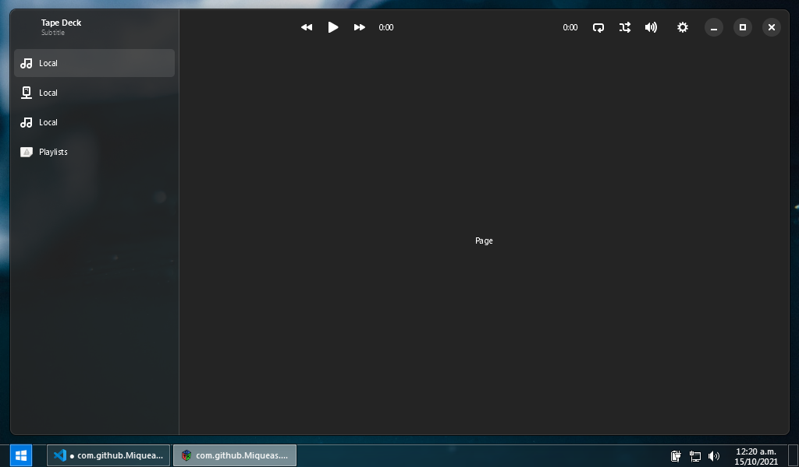

[![License][LicenseBadge]][LicenseURL]
![Github Actions status, Windows][WinBuildBadge]

# Tape Deck (WIP)

A modern, cross-platform music player, with MPD support, written in Vala


<p align="center">
  <i><sup>Current progress</sup></i>
</p>

## Building

You'll need:

 * `meson >=0.56.0`
 * `gtk4 >=4.4`
 * `libadwaita-1 >=1.0`
 * `gstreamer-1.0 >=1.18`
 * `libmpdclient >=2.19`

Then:

```
git clone https://github.com/Miqueas/TapeDeck.git
cd TapeDeck
meson . _BUILD
ninja -C _BUILD
```

[LicenseBadge]: https://img.shields.io/github/license/Miqueas/TapeDeck?label=License
[LicenseURL]: https://opensource.org/licenses/Zlib
[WinBuildBadge]: https://img.shields.io/github/workflow/status/Miqueas/TapeDeck/Windows?label=Build&logo=windows
